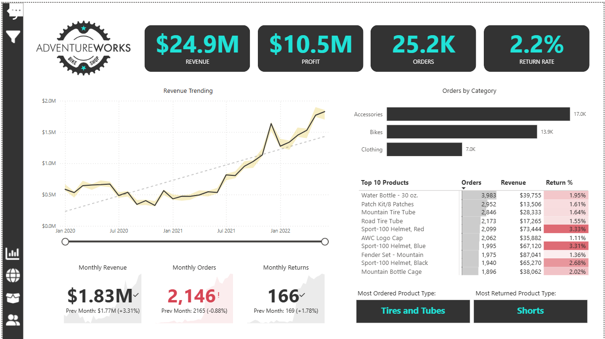
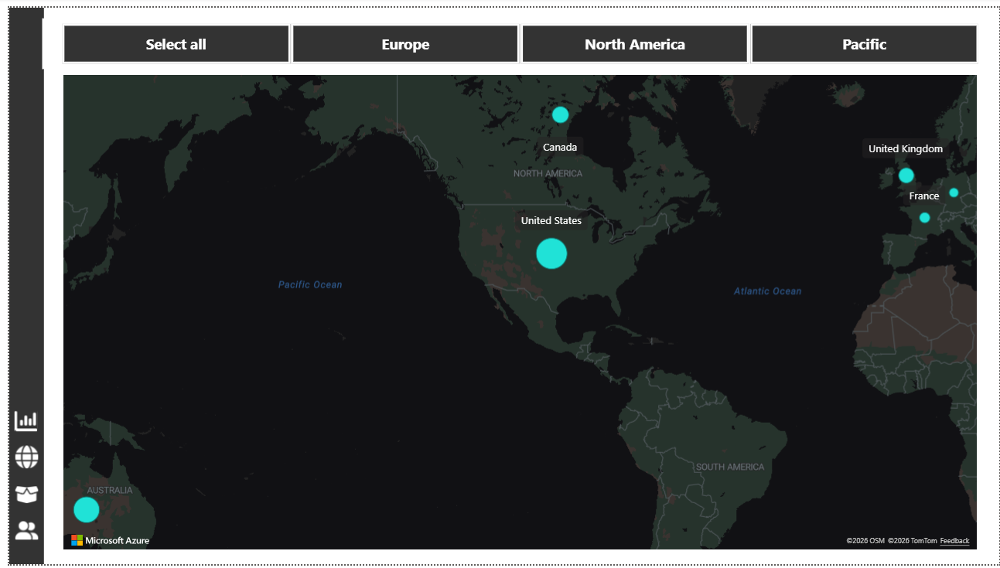
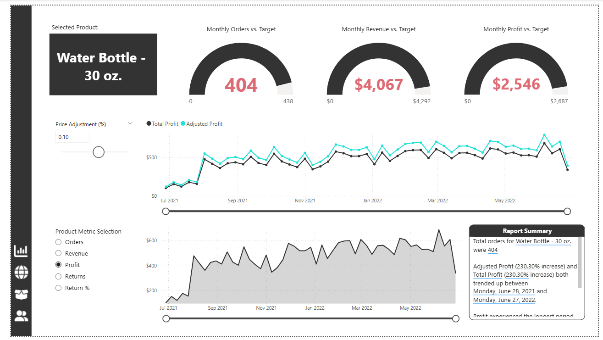
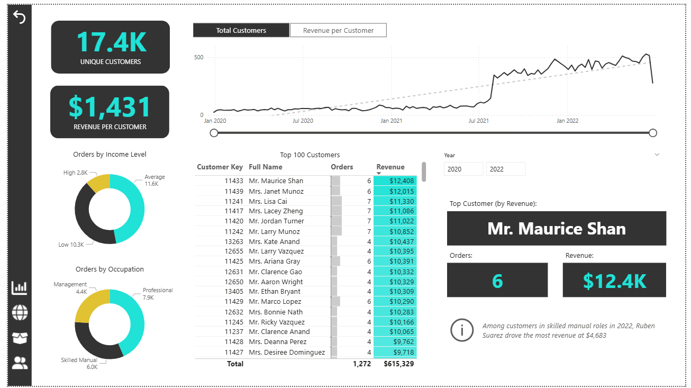
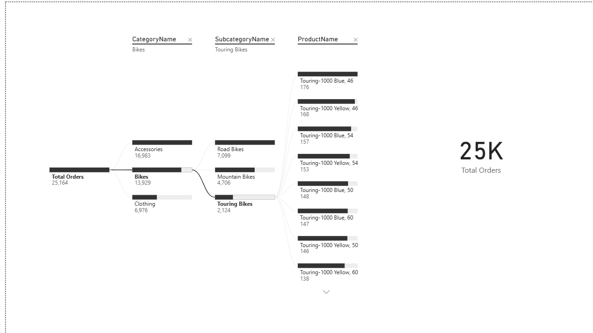
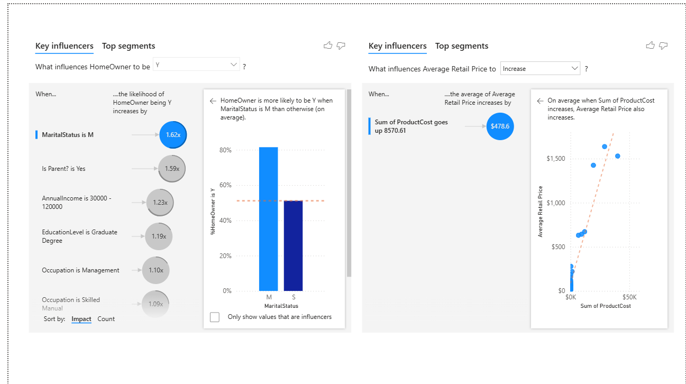

# AdventureWorks Sales Analysis Dashboard

This project is an interactive **Sales Analysis Dashboard built using Power BI**
to analyze sales performance, profitability, and business insights.

The dashboard focuses on turning raw data into meaningful insights that support
data-driven decision-making.

---

## Project Overview
- Analyze sales trends and performance
- Track key performance indicators (KPIs)
- Identify top products and customer behavior
- Explore business drivers using advanced Power BI visuals
- Apply data storytelling concepts

---

## Tools & Technologies
- Power BI
- DAX
- Power Query
- Data Modeling
- Data Visualization
- Business Intelligence

---

## Key Metrics
- Total Sales
- Total Profit
- Sales Performance
- Customer Insights
- Product Performance

---

## Dashboard Preview

### Dashboard Overview

### Map Overview

### Product Details

### Customer Details

### Decomposition Tree Analysis

### Key Influencers Analysis

---

## Files in This Repository
- Dashboard screenshots for visualization preview

---

## Notes
- Download the `.pbix` file and open it using **Power BI Desktop**
- This project emphasizes analysis and insights, not only visual design

---

## Acknowledgment
This project was completed under the supervision of **Eng.** **Mohamed Elalfy**.
